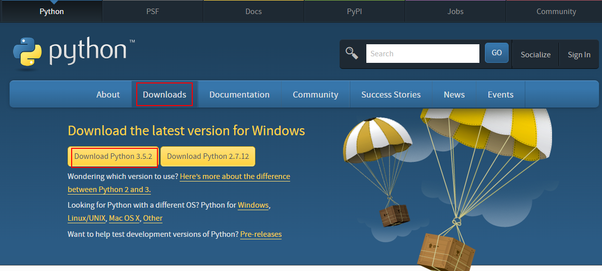
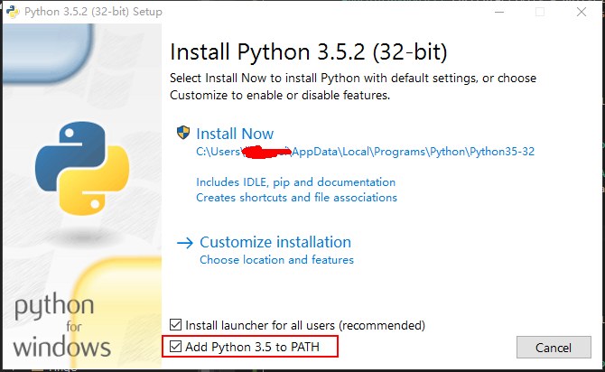
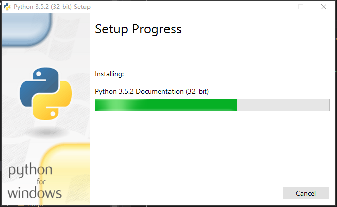
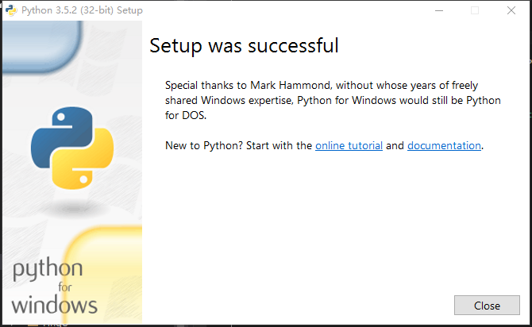
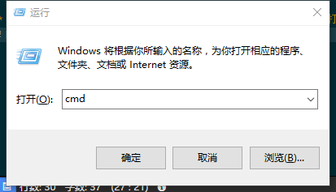
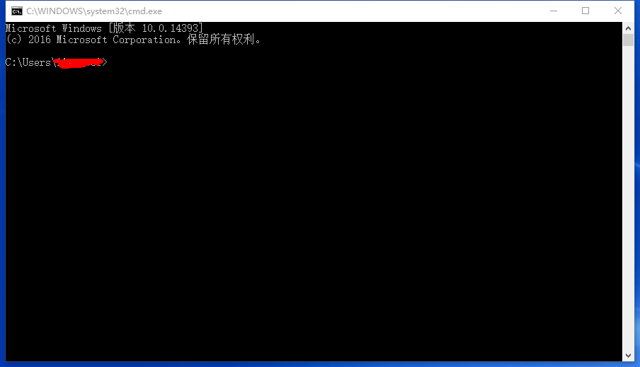
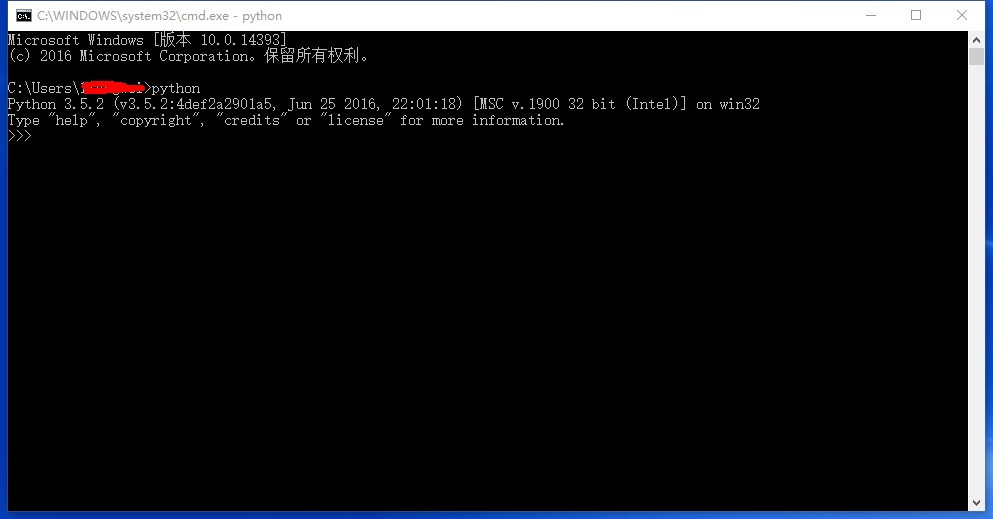

# 开发环境准备

[TOC]

	工欲善其事，必先利其器。

    Python环境准备主要针对Windows环境


## 1.开发环境安装

### 1.1 下载Python开发SDK

[官网](https://www.python.org/downloads/)下载开发SDK,本教程使用python3.x语法，因此为了减少不必要的麻烦请大家使用3.x版本SDK。这里我们下载最新SDK：python3.5.2。


### 1.2 安装Python SDK

* 双击下载好的SDK文件：python-3.5.2.exe。如图所示，请勾选 Add Python 3.5 to PATH,这样可以免去配置环境变量的麻烦。默认点击Install Now进去安装下一步，若弹出微软权限控制直接点是，安装开始。


* 安装进行中，等待


* 安装完成，点击Close


### 1.3 安装环境测试

* Windows打开命令提示符（cmd）：快捷键：win+R,输入cmd 回车打开命令提示符；



输入如下命令

``` python
python -V
```
输出应该如下所示
``` python
Python3.5.2
```

输入python进入Python交互提示模式，如下图：


在交互提示模式下输入
```python
>>> print("Hello World!")
```
将看到如下输出结果
```python
Hello World!
```
若想退出交互模式，则需输出如下命令：
```python
exit()
```

至此，python开发环境安装完毕，下节我们将开始进入python之旅。


